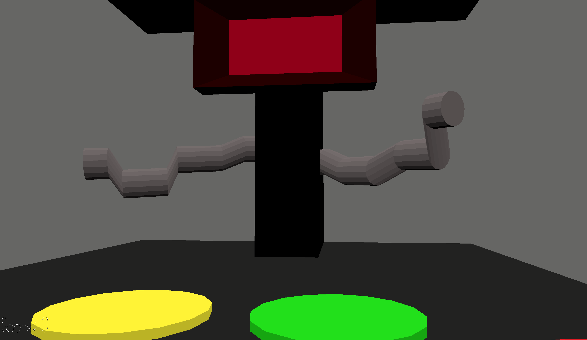

Simon Says Don't Die

Author: Ryan Lee

Design: My game is a twisted version of Simon says where instead of being a lighthearted game, the player
        now has to play simon says in order to survive. The enemy will keep on trying to make the player
        fail and will speed up over time, and the player has to do their best to stay alive for as long
        as possible.

Screen Shot:

How To Play:

The goal of this game is to survive as long as possible by not losing in Simon Says.
The player must follow the instructions of the enemy if he says "Simon Says" in the beginning,
and if not you must not follow instructions. You gain a point for each command you pass
successfully and will be a tracker of how well you played. 
When the enemy says "Go on ____" and says a color, you just have to step on the 
corresponding color tile on the floor. 

W - Move forward
A - Move left
S - Move back
D - Move right
Space - Jump

This game was built with [NEST](NEST.md).
